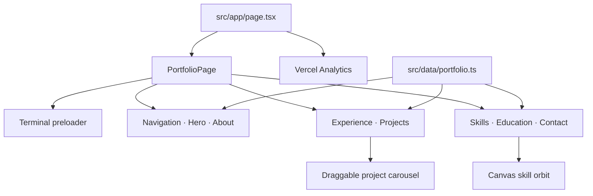

<div align="center">

<table>
<tr>
<td valign="top"></td>
<td valign="top"></td>
</tr>
</table>

# Khoi Do — Portfolio

**Human-centered AI, real-time systems, and web experiences built with product discipline.**

An interactive portfolio that turns my projects, experience, and engineering practice into one focused digital experience.

<p>
  <a href="https://www.khoido.com/"></a>
  <a href="https://github.com/Ben2104"></a>
  <a href="https://www.linkedin.com/in/hoang-khoi-do/"></a>
</p>

</div>

## Built to feel alive

This is not a static résumé page. The experience opens like a terminal, moves through a focused project narrative, and closes with a direct path to connect.

- **Terminal-first arrival** — a one-shot boot sequence sets the visual language.
- **Motion-led storytelling** — restrained transitions guide attention without blocking content.
- **Project carousel** — draggable, scroll-snapping work samples make exploration tactile.
- **Orbital skills system** — a canvas-rendered skill field turns a long technology list into an interactive visual.
- **Single source of truth** — profile, project, skill, education, and experience content live in `src/data/portfolio.ts`.

## Architecture



The App Router entrypoint stays intentionally thin. `PortfolioPage` owns section composition, while typed data and specialized client components keep content, motion, and rendering concerns separate.

## Stack

| Layer | Technology |
| --- | --- |
| Framework | Next.js 16, React 19, TypeScript |
| Styling | Tailwind CSS 4, custom CSS tokens |
| Motion and 3D | Motion, Three.js, Spline |
| UI utilities | Lucide React, clsx, tailwind-merge |
| Analytics and delivery | Vercel Analytics, Vercel |

## Run locally

Requires Node.js 20.9+ and npm.

```bash
git clone https://github.com/Ben2104/portfolio.git
cd portfolio
npm install
npm run dev
```

Open [http://localhost:3000](http://localhost:3000).

### Production check

```bash
npm run build
npm run start
```

## Project map

```text
src/
├── app/                         # App Router entrypoint, metadata, global styles
├── components/portfolio/        # Page sections and interactive experiences
│   ├── portfolio-page.tsx       # Section composition
│   ├── terminal-preloader.tsx   # Opening terminal sequence
│   ├── project-carousel.tsx     # Draggable, snapping project navigation
│   └── skills.tsx               # Canvas skill visualization
├── data/portfolio.ts            # Portfolio content and links
└── lib/                         # Shared utilities

public/
├── assets/                      # Technology icons
├── photos/                      # Profile and experience photography
├── projects/                    # Project artwork
└── resume/                      # Downloadable résumé
```

## Contact

Building something useful, technically ambitious, or human-centered?

- [LinkedIn](https://www.linkedin.com/in/hoang-khoi-do/)
- [GitHub](https://github.com/Ben2104)
- [Email](mailto:dohoangkhoi341@gmail.com)

<div align="center">

Built by [Khoi Do](https://www.khoido.com/). ASCII profile art generated with [ascii-profile-kit](https://github.com/mithun50/ascii-profile-kit).

</div>
